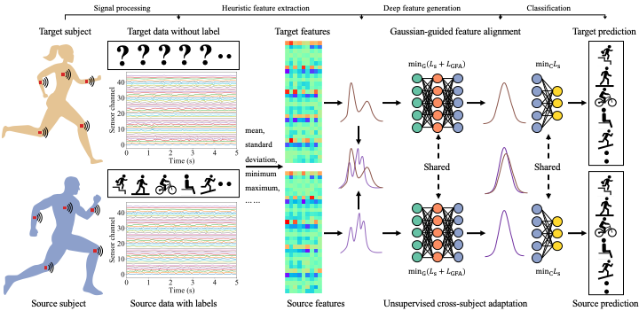

## Gaussian-guided feature alignment for unsupervised cross-subject adaptation



This is the implementation of Gaussian-guided feature alignment for unsupervised cross-subject adaptation in Pytorch.

## Getting Started
### Installation
```
pip install -r requirements.txt
```

### Download dataset
Download the dataset and checkpoint from the link below:

```
https://alumniubcca-my.sharepoint.com/:f:/g/personal/kuangen_zhang_alumni_ubc_ca/EmYydTnluklBn17qVXnSIWoBvBq0arhyATCaVlYXVs4PhA?e=evB0s7
```

### Test
```
python code/main_MCD.py --eval_only True
```

### Train
```
python code/main_MCD.py
```

## Contact

For more related works and codes, please view my homepage: https://sites.google.com/view/kuangenzhang

Further information please contact Kuangen Zhang (kuangen.zhang@alumni.ubc.ca).

## Citation
If you find our work useful in your research, please consider citing:

```bash
@article{zhang_gaussian-guided_2022,
	title = {Gaussian-guided feature alignment for unsupervised cross-subject adaptation},
	volume = {122},
	issn = {0031-3203},
	language = {en},
	urldate = {2021-10-18},
	journal = {Pattern Recognition},
	author = {Zhang, Kuangen and Chen, Jiahong and Wang, Jing and Leng, Yuquan and de Silva, Clarence W. and Fu, Chenglong},
	month = feb,
	year = {2022},
	pages = {108332},
}
```
